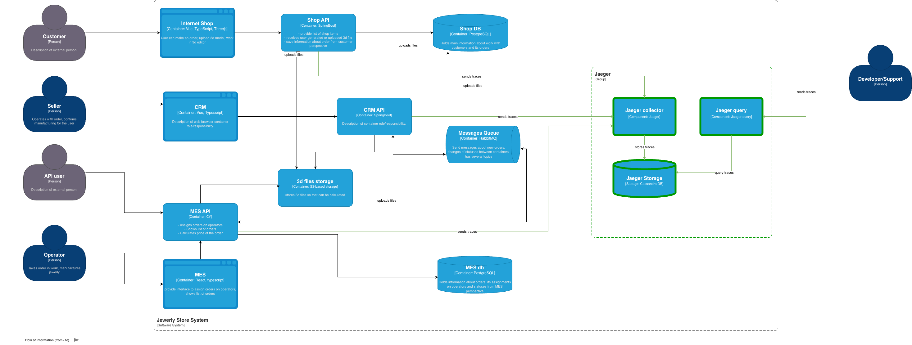
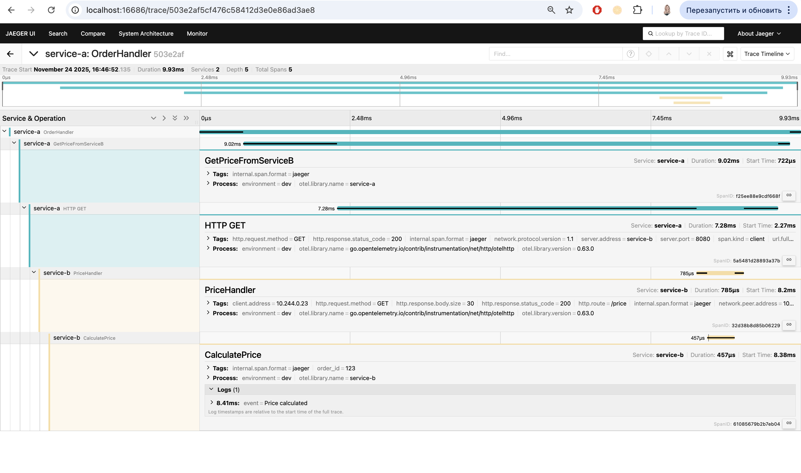

# Задание 3. Трейсинг
Команда видит, что заказы часто находятся в непонятном состоянии или зависают на каком-то сервисе внутри IT-ландшафта. Проблемы с заказами могут появляться и вовсе только потому, что сообщения теряются.
Необходимо внедрить инструмент, с помощью которого команда сможет увидеть, что происходило с заказом и где он находится сейчас

# Мотивация
Сквозной трейсинг в системе поможет решить несколько проблем:
- пропадание заказов: т.к. система состоит из нескольких микросервисов, баз данных и разных способов интеграции (очередь, API) запросы могут отваливаться по пути следования и это сложно отследить. Наличие сквозного трейсинга поможет выявить точки потери данных
- долгие запросы: операторы уже жалуются на долгую обработку запросов, при масштабировании бизнеса пользователи тоже могут с этим столкнуться. Трейсинг позволит отлавливать точки задержки (обращение к БД или к стороннему микросервису) и точечно оптимизировать систему

После внедрения трейсинга и его анализа можно ожидать изменения метрик:
- Доля потерянных заказов -> 0
- Время на решение инцидента -> 30 min
- Скорость реакции на нестандартные отклонения -> 5 min

# Предлагаемое решение
Проанализируем сценарий прохождения заказа на предмет точек потери и зависания (назовем их точка отказа):

1. Пользователь отправил запрос на сохранение заказа
2. Shop-API принял запрос на создание заказа (точка отказа)
3. Shop-API сохранил объект в БД (точка отказа)
4. Пользователь загружает файл
5. Shop-API принял запрос на загрузку (точка отказа) и передал в S3
6. S3 принял запрос (точка отказа)
7. S3 сохранил файл (точка отказа)
8. Пользователь подтвердил заказ
9. Shop-API принял запрос на подтверждение заказа (точка отказа)
10. Shop-API сохранил объект в БД (точка отказа)
11. CRM определил новый заказ в БД (точка отказа)
12. CRM отправило задание в очередь на расчет (точка отказа)
13. MES получил запрос на расчет (точка отказа)
14. MES запросил файл из S3 (точка отказа)
15. S3 принял запрос на чтение файла и отдал файл (точка отказа)
15. MES провел расчет (точка отказа)
16. MES сохранил результат расчета в БД (предположение и рекомендация по архитектуре) (точка отказа)
17. MES сохранил расчет в кэш (точка отказа)
18. MES создал сообщение с результатом расчета для CRM (точка отказа)
19. В CRM подтвердили заказ MANUFACTURING_APPROVED
20. CRM принял запрос, изменил статус в БД,  отправил в очередь (3 точки отказа)
21. MES получил заказ на производство из очереди, обновил в БД (2 точки отказа)
22. Оператор назначил заказ: MES принял запрос, сохранил в БД (2 точки отказа)
23. Оператор сменил статус: MES принял запрос, сохранил в БД (2 точки отказа)
24. Оператор отправил заказ: MES принял запрос на статус SHIPPED, сохранил в БД, отправил сообщение в очередь (3 точки отказа)
24. CRM получил статус об отправке из очереди, обновил в БД (2 точки отказа)
25. CRM получил статус от транспортной компании, обновил статус в БД (2 точки отказа)

Для лучшего исследования и отслеживания пропадания и зависания заказов, а также для анализа проблем производительности (скорость выполнения запросов, например) предлагается:
- внедрить сквозной трейсинг по заказам и основным операциям
- использовать Jaeger для отправки трейсов + Jaeger UI для просмотра трейсов
- подключить sdk OpenTelemetry в сервисы: CRM, Shop-api, MES для сборки сигналов
- Провести анализ временных метрик для определения задержек между разными этапами в сценариях высокой задержки
- При наличии инцидента о потерянном заказе после внедрения трейсинга отследить цепочку вызовов и найти точку потери, исправить баг или внедрить механизмы обеспечения целостности данных
# Данные в трейсе
В трейс должны попадать следующие данные:
- trace_id, span_id
- correlation_id = order_id / calculation_request_id
- метаинформация: endpoint запроса, order_type, operator_id, order_status, shorted_sql_query, etc  
- время начала, окончания

# Компромиссы
- Фронтенд компоненты мало смысла трассировать, т.к. по проблематике потеря заказов идет уже при успешном создании заказа, внутри системы
- S3 тоже не приоритетно, о его состоянии можно судить по трейсу shop-api, CRM-api, MES по успешности выполнения запроса
- отслеживать выполнение SQL запросов в рамках API можно не напрямую от БД, а добавлением события в сервисе, этим и ограничимся

Итого: 
Трейсинга и трассировки требуют:
- Все ключевые API вызовы (создание заказа, смена статуса, запрос на расчет от API пользователя)
- Все асинхронные движения заказа (между CRM, Shop-api, MES)
- Ключевые компоненты для трейсинга: MES, CRM API, SHOP-API. в порядке приоритета по убыванию

# Безопасность
- В трейсах должны отсутствовать персональные данные (имя заказчика, номер телефона, почта), только идентификатор при крайней необходимости
- Доступ к Jaeger, Jaeger UI, Grafana должен быть только изнутри контура компании и защищен корпоративной системой авторизации и аутентификации

 
# Автоматический мониторинг процесса прохождения заказа
Для автоматического мониторинга и оповещений можно использовать метрики:
Бизнес метрики:
- Детектор зависших заказов: заказ в статусе провел больше времени, чем мог бы, например:
    - в статусе SUBMITTED более 1 часа
    - в статусе PRICE_CALCULATED (до подтверждения отделом продаж) более 1 дня
    - в статусе MANUFACTURING_APPROVED (до взятия в работу) более 1 дня

Технические метрики:
- Error rate (доля 5xx запросов) увеличилась за 5 минут
- Длительность этапа с типом обращения к БД > 5 sec замечена на не аналитических запросах

# Задание 3.1
В рамках PoC создан тестовый проект, для запуска и проверки перейдите в папку Task3/architecture-alexandrite-k8s-trace-main в README.md

Скрин:

