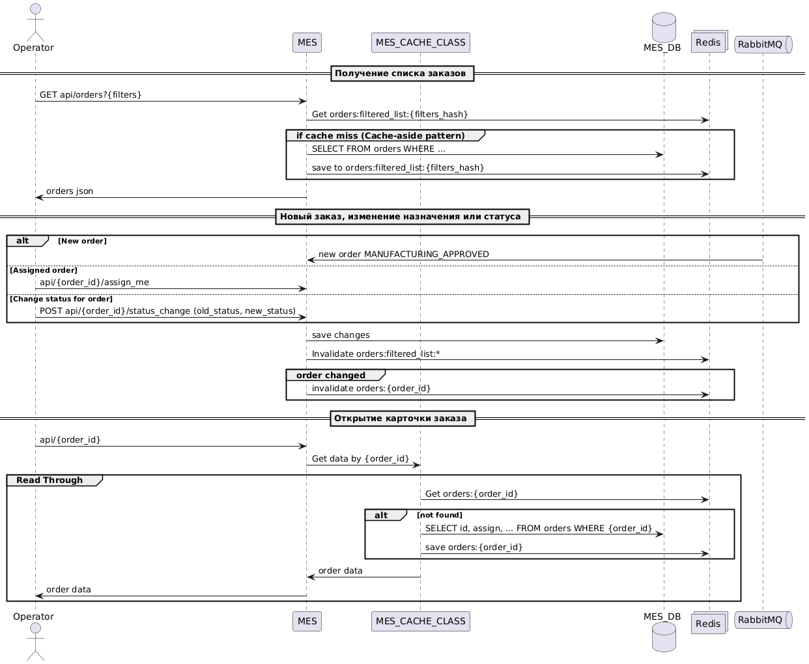
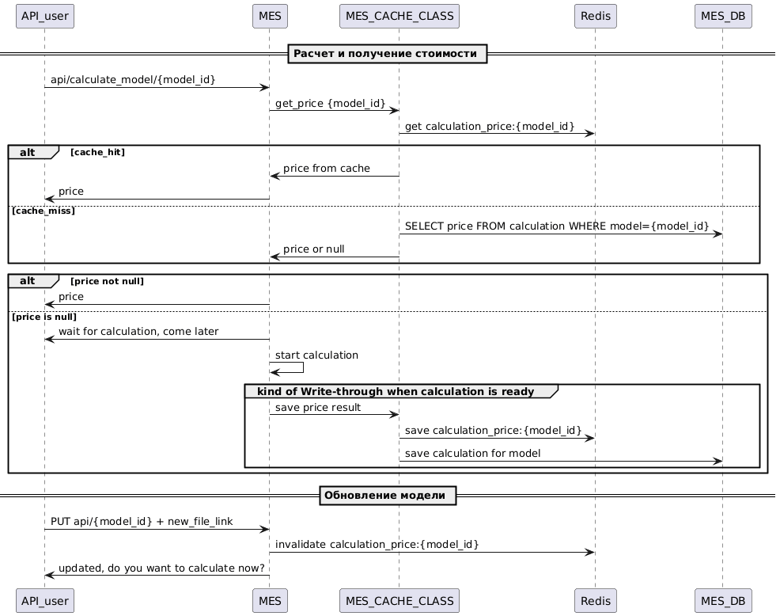

# Задание 5. Кеширование
## Мотивация
В списке опреленных и потенциальных проблем есть следующие пункты:
- Долгая прогрузка страницы дашбордов для операторов
- Будущее повышение нагрузки на API
- Долгое ожидание заказов (комплексная проблема)

Кэширование могло бы облегчить работу системы в следующих местах: 
- Запрос стоимости расчета заказа: 
    - облегчит нагрузку на БД MES
    - позволит избежать дублирования расчета
    - пользователь будет быстрее получать данные
    - для API опльзователей это может быть Game changer, т.к. "ошибочные" вызовы API несколько раз подряд могут иметь значительную роль в повышенной нагрузке     
-  Отображение списка заказов для операторов:   
    - облегчит нагрузку на БД MES
    - оператор будет быстрее получать данные
    - в этом месте наиболее важно проследить за актуальностью данных по новым заказам и назначенным заказам

Дополнительно можно было бы добавить кэширование в сценариях: 
- Отображение списка заказов и статусов для пользователя:
- Отображение списка заказов в CRM
Но эти сценарии сейчас не создают проблемы, рассмотрим только первостепенные.

Рекомендуется использовать инструмент распределенного кэширования, например Redis, исходя из планируемого горизонтального масштабирования сервисов (при кэшировании в памяти приложения данные могут расходиться между экземплярами)

# Предлагаемое решение
Клиентское решение незначительно влияет на нагрузку на приложение, т.к. проблему составляют динамичные данные, в любом случае их придется часто обновлять. 
Внедрение HTTP кэширования в данном случае не первостепенно, но может использоваться для более быстрой прогрузки статики или для еще большего ускорения после внедрения серверного кэширования. Например:
- Для списка заказов онлайн магазина: Cache-Control: private, no-cache
- Для списка заказов в онлайн магазине ксли разделить запрос на архивные заказы и актуальные заказы:
    - Для архивных заказов: ```Cache-Control: private, max-age=86400```
    - Для активных заказов: ```Cache-Control: private,  no-cache```
Для оператора MES важна консистентность данных:
    - ```Cache-Control: private, no-cache```

## Серверное кэширование
Серверное кэширование рассматриваем как основное, т.к. нагрузку создают часто меняющиеся данные, а не статичные
### Схема хранения кэша
- ```orders:{order_id}``` - данные по заказу
- ```orders:filter_list:{filters_hash}``` - список заказов по фильтрам
- ```calculation_price:{model_id}``` - расчитанная стоимость заказа

### Дашборды операторов
Проблема операторов содержит несколько сценариев:
- получение списка новых заказов
- прочтение данных о заказе
- назначение заказа оператору
- максимальную актуальность требуют данные:
        - о том на кого назначен заказ, иначе операторы могут брать уже назначенные заказы, что приведет к ошибкам 
        - о новых заказах, иначе может быть простой работы оператора
- редко обновляемые данные и маловажные статусы для дашборда: заказы в статусах SHIPPED, CLOSED

**Прочтение данных карточки о заказе**
- Write-through может быть избыточна по объему хранимых данных, если хранить данные по не интересующим операторов заказам
- Используем Read-Through для кэширования информации по определенному заказу ```orders:{order_id}```. Эта стратегия позволит актуализировать кэш при наличии запроса, структура чтения не значительно отличается от структуры в БД.
- Можно использовать Cache-aside по той же логике при необходимости гибкости в структуре
- Инвалидация при изменении: при изменении статуса или назначения

**Получение списка заказов на главной странице**
- Для главной страницы наверняка потребуется гибкость структуры данных, поэтому рассмотрим только стратегию Cache-aside, т.к.:
    - самая простая и надежная стратегия
    - чтение списка заказов типичный read-heavy сценарий
    - гибкое управление кэш структурами и данными
    - устойчивость к сбоям
    - отсутствие риска потери данных

**Cache-aside при чтении:**
- Ключ кэширования ```orders:filter_list:{filters_hash}``` - array JSON
- Первый запрос по фильтрам будет самым долгим, последующие быстрее
- Пополнение кэша при запросе страницы с дашбордом
- Требуется частая инвалидация - при появлении нового заказа, при изменении статуса, при назначении заказа
- Инвалидация по TTL как защита от рассинхронизаций. Положим TTL = 2 часа
- Считаем, что запросов на чтение больше, чем действий по смене статуса, появлении заказа или назначении заказа, поэтому стратегия допустима

**Cache-aside при записи:**
- Наличие пагинации и фильтрации,а также визуализация в виде дашборда усложняет возможности актуализации кэша при записи. Можно было бы рассмотреть формирование кэша вида:
    - ```orders:list:{status}``` - array JSON
    - добавлять заказ в список при его появлении и удалять при смене статуса
    - это очень сложный механизм, который зависит от веб-интерфейса и экспертизы команды в redis структурах
    - можно использовать для дальнейшей оптимизации, но сортировку и доп. фильтрацию придется проводить в памяти приложения (это можен быть долго и требовать ресурсов)




<details>
<summary>Код диаграммы</summary>
@startuml
actor Operator
participant MES
participant MES_CACHE_CLASS
database MES_DB
collections Redis
queue RabbitMQ

== Получение списка заказов ==
Operator -> MES: GET api/orders?{filters}
MES -> Redis: Get orders:filtered_list:{filters_hash}
group if cache miss (Cache-aside pattern)
  MES -> MES_DB: SELECT FROM orders WHERE ...
  MES -> Redis: save to orders:filtered_list:{filters_hash}
end
MES -> Operator: orders json

== Новый заказ, изменение назначения или статуса ==
alt New order
  RabbitMQ -> MES: new order MANUFACTURING_APPROVED
else Assigned order
  Operator -> MES: api/{order_id}/assign_me
else Change status for order
  Operator -> MES: POST api/{order_id}/status_change (old_status, new_status)
end
MES -> MES_DB: save changes
MES -> Redis: Invalidate orders:filtered_list:*
group order changed
  MES -> Redis: invalidate orders:{order_id}
end

== Открытие карточки заказа ==
Operator -> MES: api/{order_id}
MES -> MES_CACHE_CLASS: Get data by {order_id}
group Read Through
  MES_CACHE_CLASS -> Redis: Get orders:{order_id}
  alt not found
    MES_CACHE_CLASS -> MES_DB: SELECT id, assign, ... FROM orders WHERE {order_id}
    MES_CACHE_CLASS -> Redis: save orders:{order_id}
  end
  MES_CACHE_CLASS -> MES: order data
  MES -> Operator: order data
end
@enduml
</details>

### Сценарий получения стоимости 
- Для сценария получения стоимости изделия основной стратегией можно использовать Read-Through (считаем что стоимость расчета сохранена в БД в той же структуре, которая нужна для выдачи) 
- Для более оперативной актуализации используем Write-Through
- ❗️ для подбора TTL и принятия решении о Write-Through требуется анализ пользовательского поведения: проверить нагрузку и распределение по времени запросов стоимости после задания на расчет. Если заданий на расчет больше, чем запросов итоговой стоимости - использование Write-Through излишне.
- Инвалидация при обновлении файла модели
- Инвалидация по TTL, допустим 1 день (нужен доп. анализ для подбора времени заинтересованности и объема данных)
- Для лучшей гибкости можно использовать тот же сценарий, но на основе Cache-Aside (обращение к БД из приложения, а не из класса кэша)

Ключи:
- ```calculation_price:{model_id}```



<details>
<summary>Код диаграммы</summary>
@startuml
== Расчет и получение стоимости ==
API_user -> MES: api/calculate_model/{model_id}
MES -> MES_CACHE_CLASS: get_price {model_id}

MES_CACHE_CLASS -> Redis: get calculation_price:{model_id}
alt cache_hit
  MES_CACHE_CLASS -> MES: price from cache
  MES -> API_user: price
else cache_miss
  MES_CACHE_CLASS -> MES_DB: SELECT price FROM calculation WHERE model={model_id}
  MES_CACHE_CLASS -> MES: price or null
end
alt price not null
  MES -> API_user: price
else price is null
  MES -> API_user: wait for calculation, come later
  MES -> MES: start calculation
  group kind of Write-through when calculation is ready
    MES -> MES_CACHE_CLASS: save price result
    MES_CACHE_CLASS -> Redis: save calculation_price:{model_id}
    MES_CACHE_CLASS -> MES_DB: save calculation for model
    
  end
end
  
== Обновление модели ==
API_user -> MES: PUT api/{model_id} + new_file_link
MES -> Redis: invalidate calculation_price:{model_id}
MES -> API_user: updated, do you want to calculate now?

@enduml
</details>
